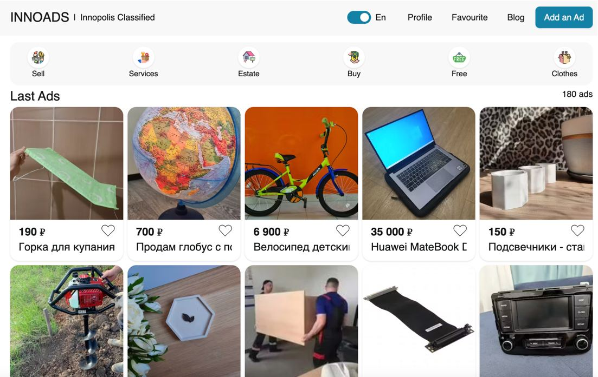

 

I love to share experience and being a thankful student.

### 💼 Technical Skills:
— React, Redux, Next.js, Node.js (Express.js, Nest.js)
— JavaScript + TypeScript\
— E2E, unit testing (react-testing-library)\
— Preprocessors: SCSS/SASS/LESS,TailwindCSS\
— Cross-browser development\
— Graphic editors: Figma\
— Other: Git, BEM\
— Scrum, Jira, YouTrack

### Portfolio:
FullStack (Next.JS +. Nest.JS) Classified: https://innoads.ru

frontend: [https://github.com/innoads-frontend](https://github.com/maratismodest/innoads-frontend) 
backend: [https://github.com/innoads-backend](https://github.com/maratismodest/innoads-backend)

### 🤝 Connect with me:
Feel free to text me via Telegram: https://t.me/maratfaizer
